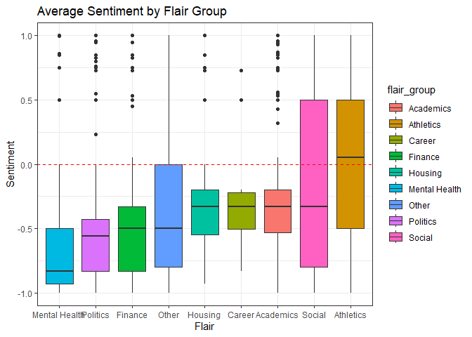
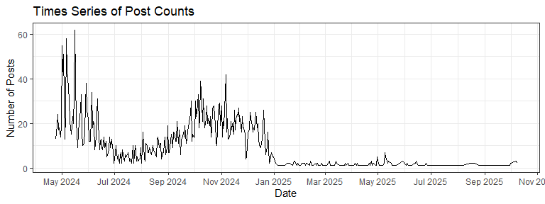

# UC Subreddit Analysis
Christopher Chen and Sean Saito
2025-10-16

This project aims to analyze the different micro-political climates
across campuses in the University of California system. We are using
data from Reddit, scraped using `.json` requests in Python.

## Exploratory Data Analysis

### Sentiment

Our data consists of post and comment data from the subreddits of all 9
UC campuses. This includes UC Berkeley, UCLA, UC Santa Barbara, UC
Davis, UC San Diego, UC Santa Cruz, UC Riverside, UC Irvine, and UC
Merced. Each subreddit was scraped for about 500 posts from the “Top”
posts in the last year. The data set we compiled will have 4189
observations with 9 variables. We have data on the upvotes/score on a
post, time created, and number of comments. Using LLMs, we measured the
sentiment of each post from negative to positive to neutral.

<details class="code-fold">
<summary>Show the code</summary>

``` r
par(mfrow = c(2, 1))
sentiment_counts <- as.data.frame(table(UC_posts_data$rate_sentiment)) %>% 
  rename(value = Freq) %>% 
  rename(sentiment = Var1)
ggplot(sentiment_counts, aes(x= "", y= value, fill = sentiment)) +  # SENTIMENT PIE
  geom_bar(stat="identity", width=1, col = "white") +
  coord_polar("y", start=0) +
  labs(title = "Pie Chart of Post Sentiment Ratings") +
  theme_void() +
  scale_fill_brewer(palette="Dark2")
kable(sentiment_counts)
```

</details>

| sentiment | value |
|:----------|------:|
| negative  |  2849 |
| neutral   |   424 |
| positive  |   895 |


As to be expected from online platforms and social media, the majority
of posts created on the UC subreddits are negative in sentiment.

### Categories of Discussion

Using LLMs we were able to categorize each post by common topics of
college discussions. These include politics, housing, academics, and
more. Let’s take a look at the sentiment for each category.

<details class="code-fold">
<summary>Show the code</summary>

``` r
UC_flair_summary <- UC_posts_data %>% 
  group_by(flair_group) %>% 
  summarize("Mean Sentiment" = mean(post_sentiment), 
            "Negative" = sum(rate_sentiment == "negative"),
            "Neutral" = sum(rate_sentiment == "neutral"),
            "Positive" = sum(rate_sentiment == "positive"),
            "Total" = n()) %>% 
  arrange(desc(`Total`)) %>% 
  rename("Flair" = flair_group)
kable(UC_flair_summary)
```

</details>

| Flair         | Mean Sentiment | Negative | Neutral | Positive | Total |
|:--------------|---------------:|---------:|--------:|---------:|------:|
| Social        |     -0.1327946 |      605 |     113 |      402 |  1120 |
| Mental Health |     -0.5584869 |      614 |      37 |      111 |   762 |
| Politics      |     -0.5219763 |      612 |      81 |       66 |   759 |
| Academics     |     -0.2392090 |      359 |      75 |       97 |   531 |
| Finance       |     -0.4274755 |      406 |      34 |       71 |   511 |
| Athletics     |      0.1174038 |       72 |      33 |      103 |   208 |
| Other         |     -0.3308140 |      109 |      35 |       28 |   172 |
| Housing       |     -0.2883146 |       62 |      12 |       15 |    89 |
| Career        |     -0.2650000 |       10 |       4 |        2 |    16 |

<details class="code-fold">
<summary>Show the code</summary>

``` r
ggplot(UC_posts_data) +
  geom_boxplot(aes(x=reorder(flair_group, post_sentiment), post_sentiment, fill = flair_group)) + # sentiment by flair
  labs(title = "Average Sentiment by Flair Group", x = "Flair", y = "Sentiment") +
  geom_hline(yintercept = 0, col = "red", linetype = "dashed") +
  theme_bw()
```

</details>



#### Time

The subreddits also gave us UNIX time stamps for when each post and
comment was made. Using this, we can find the exact time a post was
created down to the millisecond. The response time of comments to a
particular post was calculated as well. Let’s see when the Top posts
were created:

<details class="code-fold">
<summary>Show the code</summary>

``` r
daily_counts <- UC_posts_data %>%
  count(date)
ggplot(daily_counts) +    # Times series for number of posts in time period
  geom_line(aes(x = date, y = n)) +
  labs(title = "Times Series of Post Counts", x = "Date", y = "Number of Posts") +
  scale_x_date(
    date_breaks = "2 month",  # Set breaks at every month
    date_labels = "%b %Y") +       # Format labels to show abbreviated month names (e.g., Jan, Feb)
  theme_bw()
```

</details>


We can observe an expected dip in activity during the summer months.
Let’s do the same for the comments in the time period that we were able
to scrape.

<details class="code-fold">
<summary>Show the code</summary>

``` r
UC_comments_time <- UC_comments %>% 
  mutate(timestamp = as.POSIXct(created_utc, origin = "1970-01-01", tz = "UTC")) %>% 
  mutate(date = as.Date(timestamp))
daily_counts <- UC_comments_time %>% 
  count(date)
ggplot(daily_counts) +    # Times series for number of comments in time period (that were able to be scraped)
  geom_line(aes(x = date, y = n)) +
  labs(title = "Times Series of Comment Counts", x = "Date", y = "Number of Comments") +
  scale_x_date(
    date_breaks = "2 month",  # Set breaks at every month
    date_labels = "%b %Y") +       # Format labels to show abbreviated month names (e.g., Jan, Feb)
  theme_bw()
```

</details>



Testing
